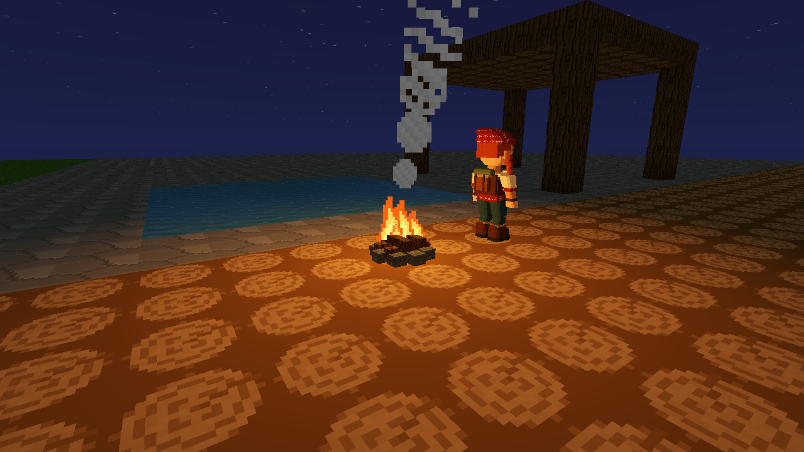
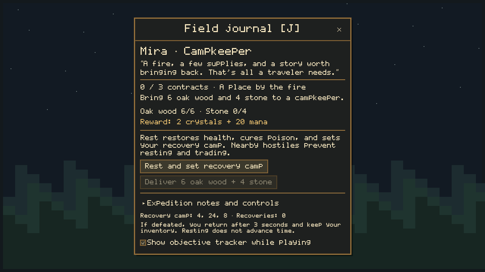

# Camps and expeditions

The campkeeper contracts are optional. Building, crafting and world rules remain
available from the start.

## Getting started

New worlds look for a dry, clear patch within 24 blocks of the starting area and
place a real campfire there, with a waypoint and welcome message. This does not
reshape terrain. If no safe patch exists, find a natural campfire or use a campfire
spell. Existing worlds gain the same interactions at their existing fires without
placing a new starter camp over saved construction.

A nearby fire with a clear standing space has a named keeper. Look at the keeper
or fire and press **F**. This opens the journal dialogue. Camp actions require sight
of the fire within six blocks and fail if a hostile creature is within ten blocks
of the player. The host rechecks these conditions when processing an action.

**Rest and set recovery camp** restores health, cures poison and records a safe
standing location beside the fire. It does not skip time or refill mana/oxygen.
Clear space beside a blocked fire before resting there.

## Three personal contracts

| Contract | Requirement | Reward |
|---|---|---|
| A place by the fire | Deliver 6 oak wood and 4 stone | 2 crystals, 20 mana |
| Into the depths | While this contract is active, enter roofed underground air at Y 2–12; then return | 3 iron, 30 mana |
| Forge your own path | While this contract is active, successfully craft a new axe, pickaxe or sword in C; then return | 2 redstone, 40 mana, Wayfinder title |

Materials for the first contract are consumed only when its claim succeeds. Merely
owning a starting tool does not complete the third contract. Earlier exploration
or crafting does not skip a later contract. Rewards can be claimed at any fire,
once per contract per saved player account; repeat claims do not pay again.
Death, reconnecting and saving do not reset progress. Guest identity follows the
project's existing account-key behavior; changing that identity can select a
different inventory and journal.

## Expedition controls

| Control | Action |
|---|---|
| J | Open/close the field journal; inspect progress and controls; hide/show the objective tracker |
| F at a keeper/fire | Talk, rest or claim a completed contract |
| I | Assign a crystal resource stack to a hotbar slot |
| Select the crystal slot | Illuminate terrain within six blocks, including daytime caves |
| M | Open the map; mark recovery camp or nearest cave entrance |
| Right-click the map | Place a waypoint; its distance and compass quadrant appear in the tracker |
| C | Craft tools and materials |
| B | Build/configure automation |
| Backquote (`) | Describe a new world rule |

Holding a crystal uses no charge and does not consume it. Switching away or
emptying the stack removes its light. Nearby other players' held crystals also
emit light. The four-light budget is shared with campfires and machinery; lights
have distance falloff but no wall occlusion. A selected map waypoint is temporary;
the recorded recovery camp is saved. The nearest-cave shortcut searches the
procedural map within 192 blocks and is not a guarantee of a clear walking route.

Aim at a visible nearby creature to see its health and hostile/passive status.
A brief red border signals damage. The journal tracker avoids the rules panel
and can be hidden from the journal if you prefer free exploration.

## Defeat and recovery

At zero health, movement stops. After three seconds the host returns you to your
recovery location, restores health and oxygen, clears poison and movement
multipliers, and grants ten seconds of protection from creature attacks. Inventory,
equipment, mana and contracts remain intact. World spells and environmental damage
can still affect you; the grace period protects against creatures.

If a recovery spot was buried or destroyed, the host searches nearby safe air and
then the local surface. An entirely obstructed edited area falls back above the
world rather than searching forever. Recovery does not rebuild a destroyed camp.

The world keeps simulating while the journal is open. Closing the panel does not
undo a submitted camp action. Resting and claiming require a living player, and
host-side item/automation/crafting actions are blocked during recovery.

## Scripting and compatibility

World API **1.27.0** adds `api.get_player_journal(player_id)` and
`api.get_equipped_item(player_id)`. The former returns detached saved progression;
the latter returns the current nonempty selection, unlike the historical
`carrying_crystal` flag. Inventory callbacks preserve journal state and the queries
observe staged inventory changes. Scripts cannot directly claim the built-in rewards.

[wayfinder_crystal_ward.lua](examples/wayfinder_crystal_ward.lua) is a tested optional
rule: completed Wayfinders holding crystals receive protection from goblin melee.
It is documentation, not an automatically activated starter rule. Natural-language
requests can use these same capabilities through the updated API context.

Keeper appearances are derived from campfire blocks and clear adjacent space, with
at most four rendered within 32 blocks. They do not wander, fight, trade arbitrary
items or appear in `api.creatures()`. Removing the fire removes its keeper. F still
emits the campfire `on_interact` event, so existing world rules can react.

Current saves retain their format; missing journal fields default safely. Multiplayer
protocol is **31**, so all players need this build. Playtesting-agent work remains paused.
