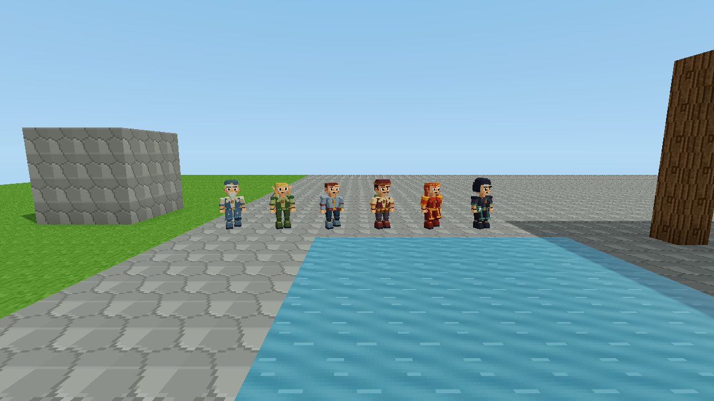
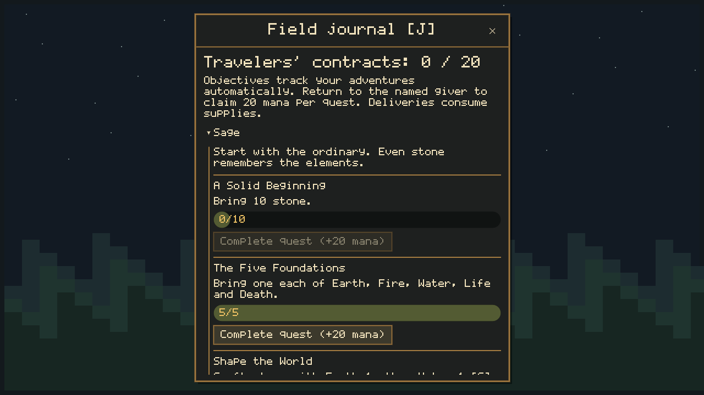

# Camps and expeditions

## Six travelers and twenty quests

The Sage, Elf Ranger, Warrior, Merchant, Fire Sorceress and Necromancer use the
animated models in `models/npc`. The starting area has the campkeeper plus **one
random traveler**. Further travelers appear as any player explores, with one
potential encounter per **100 × 100 block region**, small seeded offsets and a
search for safe dry ground. Expect roughly 100 blocks between encounters on land;
water, obstructed terrain and the direction you travel affect the actual spacing.
Roles can repeat; each role offers the same personal quests wherever encountered.
Each follows a small, dry-ground patrol within four
blocks of its home, stops to face nearby players, and avoids terrain and devices.
They are peaceful quest givers, separate from combat creatures. If construction
blocks a patrol, clear its path. They do not reshape saved terrain.

Encounter locations, roles and explored regions persist across save/reload.
Returning to an explored region does not spawn duplicates, and moving your recovery
camp does not move the encounter grid. Existing six-traveler starting groups migrate
to one traveler on load; all player quest progress is retained. Distant travelers
pause their patrols, and multiplayer clients receive only nearby travelers.

Look at a traveler and press **F** to talk. **J** lists all twenty contracts.
Objectives track automatically and can be completed in any order. Crafting and
kills count from this update onward; delivery quests use current inventory.
Each quest pays **20 mana once**. Deliveries consume the requested materials.

Rewards require a living player within six blocks with an unobstructed view of
the correct giver. The host checks every claim, including guest claims.

| # | NPC | Quest | Objective |
|---|---|---|---|
| 1 | Sage | A Solid Beginning | Bring 10 stone |
| 2 | Sage | The Five Foundations | Bring 1 each of Earth, Fire, Water, Life and Death |
| 3 | Sage | Shape the World | Craft stone using elemental crafting |
| 4 | Sage | A Little Reserve | Place a Mana Vessel and store at least 10 mana |
| 5 | Elf Ranger | Wood for the Watch | Bring 12 oak wood |
| 6 | Elf Ranger | Hungry Shadows | Defeat 2 wolves |
| 7 | Elf Ranger | Ready for the Wilds | Equip a bow |
| 8 | Warrior | Your First Blade | Craft a sword |
| 9 | Warrior | Restless Bones | Defeat 3 skeletons |
| 10 | Warrior | Back to the Grave | Defeat 3 zombies |
| 11 | Warrior | A Sharper Lesson | Defeat 1 goblin |
| 12 | Merchant | Room for More | Place a chest |
| 13 | Merchant | Fresh Supplies | Bring 20 oak wood and 10 stone |
| 14 | Merchant | From Ore to Ingots | Produce 3 metal ingots in an Ore Smelter |
| 15 | Fire Sorceress | A Handful of Sparks | Bring 3 Fire |
| 16 | Fire Sorceress | A Place to Warm Your Hands | Light a campfire |
| 17 | Fire Sorceress | Light Against the Dark | Place and power a Mana Lantern |
| 18 | Necromancer | Nothing Is Wasted | Bring 3 Death |
| 19 | Necromancer | Borrowed Power | Process 1 Death in an Element Dissipator |
| 20 | Necromancer | An Unexpected Interest | Craft a bound sheep figurine |

Use **C** for stone, swords, bows and the bound sheep button. Use **I** to assign
and equip a bow. Use **B** to place machinery and **F** to configure, deposit or
charge it. The Sorceress's campfire button costs **3 oak wood + 2 stone** and
lights a real fire on nearby clear, level ground. No supplies are spent if there
is no safe space. Her lantern objective requires your placed lantern to actually
shine; a charged but disabled lantern does not count.

Machine production tracks the most recent smelter, dissipator and workshop you
placed or supplied directly. Put ore plus fuel (or mana) into a smelter. Configure
a dissipator to Death before depositing Death. Configure a workshop to sheep and
supply Life plus mana to make its bound figurine. Only subsequent completed
production counts; old stock and packed historical cycles do not. Several players
may cooperate on the same machine and receive future production credit after
supplying it. Packing clears that player's tracked location; placing it again
starts a new observation. Vessel and lantern objectives require personal placement.

NPC homes, positions and patrol state, machine production counters and every
player's quest progress survive saving. There is no offline quest production.
Combat credit goes to the player delivering the killing weapon hit. Host and
guests need the updated build (protocol 33). Lua reads these contracts through
`get_player_journal(player_id).quests`; scripts cannot claim their rewards.

The campkeeper contracts are optional. Building, crafting and world rules remain
available from the start.

## Getting started

New worlds look for a dry, clear patch within 24 blocks of the starting area and
place a real campfire there, with a waypoint and welcome message. This does not
reshape terrain. If no safe patch exists, find a natural campfire or use a campfire
spell. Existing worlds gain the same interactions at their existing fires without
placing a new starter camp over saved construction.

A nearby fire with a clear standing space has a named keeper. Look at the keeper
or fire and press **F**. This opens the journal dialogue. Camp actions require sight
of the fire within six blocks and fail if a hostile creature is within ten blocks
of the player. The host rechecks these conditions when processing an action.

**Rest and set recovery camp** restores health, cures poison and records a safe
standing location beside the fire. It does not skip time or refill mana/oxygen.
Clear space beside a blocked fire before resting there.

## Three personal contracts

| Contract | Requirement | Reward |
|---|---|---|
| A place by the fire | Deliver 6 oak wood and 4 stone | 2 crystals, 20 mana |
| Into the depths | While this contract is active, enter roofed underground air at Y 2–12; then return | 3 iron, 30 mana |
| Forge your own path | While this contract is active, successfully craft a new sword in C; then return | 2 redstone, 40 mana, Wayfinder title |

Sword crafting is shown in **C → Tools and weapons**: **2 iron + 1 oak wood + 4 mana**
(mana is waived in the host's testing mode). Axe and pickaxe recipes are there too.
Previously credited tool crafting in older saves is retained.

Materials for the first contract are consumed only when its claim succeeds. Merely
owning a starting tool does not complete the third contract. Earlier exploration
or crafting does not skip a later contract. Rewards can be claimed at any fire,
once per contract per saved player account; repeat claims do not pay again.
Death, reconnecting and saving do not reset progress. Guest identity follows the
project's existing account-key behavior; changing that identity can select a
different inventory and journal.

## Expedition controls

| Control | Action |
|---|---|
| J | Open/close the field journal; inspect progress and controls; hide/show the objective tracker |
| F at a keeper/fire | Talk, rest or claim a completed contract |
| I | Assign a crystal resource stack to a hotbar slot |
| Select the crystal slot | Illuminate terrain within six blocks, including daytime caves |
| M | Open the map; mark recovery camp or nearest cave entrance |
| Right-click the map | Place a waypoint; its distance and compass quadrant appear in the tracker |
| C | Craft tools and materials |
| B | Build/configure automation |
| Backquote (`) | Describe a new world rule |

The top HUD compass follows your view; north is -Z and east is +X, matching the map.
When inspecting a machine with F or positioning one in build mode, a small N/E/S/W
compass floats over it. These are world directions and do not rotate with its ports.
See [crafting recipes](../CRAFTING.md) for twelve additional elemental formulas.

Holding a crystal uses no charge and does not consume it. Switching away or
emptying the stack removes its light. Nearby other players' held crystals also
emit light. The four-light budget is shared with campfires and machinery; lights
have distance falloff but no wall occlusion. A selected map waypoint is temporary;
the recorded recovery camp is saved. The nearest-cave shortcut searches the
procedural map within 192 blocks and is not a guarantee of a clear walking route.

Aim at a visible nearby creature to see its health and hostile/passive status.
A brief red border signals damage. The journal tracker avoids the rules panel
and can be hidden from the journal if you prefer free exploration.

## Defeat and recovery

At zero health, movement stops. After three seconds the host returns you to your
recovery location, restores health and oxygen, clears poison and movement
multipliers, and grants ten seconds of protection from creature attacks. Inventory,
equipment, mana and contracts remain intact. World spells and environmental damage
can still affect you; the grace period protects against creatures.

If a recovery spot was buried or destroyed, the host searches nearby safe air and
then the local surface. An entirely obstructed edited area falls back above the
world rather than searching forever. Recovery does not rebuild a destroyed camp.

The world keeps simulating while the journal is open. Closing the panel does not
undo a submitted camp action. Resting and claiming require a living player, and
host-side item/automation/crafting actions are blocked during recovery.

## Scripting and compatibility

World API **1.27.0** adds `api.get_player_journal(player_id)` and
`api.get_equipped_item(player_id)`. The former returns detached saved progression;
the latter returns the current nonempty selection, unlike the historical
`carrying_crystal` flag. Inventory callbacks preserve journal state and the queries
observe staged inventory changes. Scripts cannot directly claim the built-in rewards.

[wayfinder_crystal_ward.lua](examples/wayfinder_crystal_ward.lua) is a tested optional
rule: completed Wayfinders holding crystals receive protection from goblin melee.
It is documentation, not an automatically activated starter rule. Natural-language
requests can use these same capabilities through the updated API context.

Keeper appearances are derived from campfire blocks and clear adjacent space, with
at most four rendered within 32 blocks. They do not wander, fight, trade arbitrary
items or appear in `api.creatures()`. Removing the fire removes its keeper. F still
emits the campfire `on_interact` event, so existing world rules can react.

Current saves retain their format; missing journal fields default safely. Multiplayer
protocol is **36**, so all players need this build. Playtesting-agent work remains paused.

Floating recipe books now teach [16 specialist equipment recipes](EQUIPMENT_AND_RECIPE_BOOKS.md).
Look at a book and press F to read it; C opens the searchable equipment catalog.
