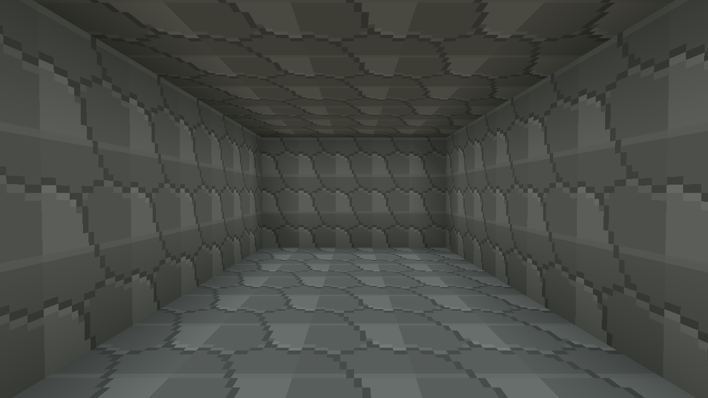
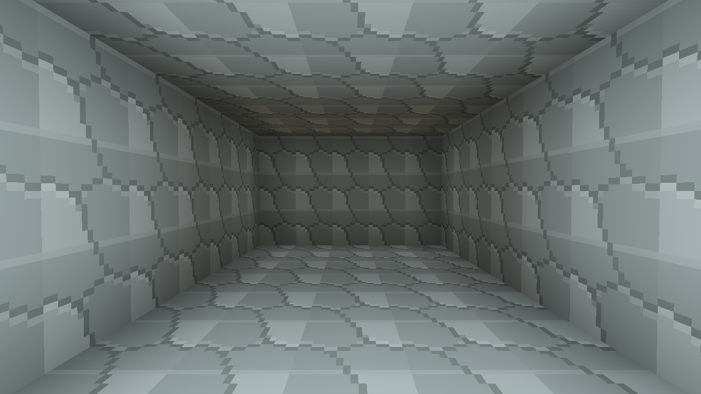

# Sandbox / RPG review and two-hour improvement pass

Reviewed 2026-09-13. This is a player-oriented assessment grounded in source inspection,
automated gameplay tests and offscreen GPU/UI previews. It is not a claim of a complete
human playthrough or a four-player acceptance session.

## Verdict

The project has a stronger sandbox foundation than its first few minutes communicate.
Terrain, mining, elemental crafting, machinery, wildlife and editable world rules can
interact in interesting ways. The distinguishing promise is making a rule and watching
the shared world obey it. More unrelated content would bury that promise further.

The weakest part was the connection between these systems: a new player had many
controls but little reason to choose a destination, prepare supplies or return home.
Health could reach zero without a complete defeat/recovery loop. Caves supplied
geometry and loot but poor orientation and limited portable lighting. The short-term
priority is to make one expedition understandable and satisfying.

## Assessment by aspect

| Aspect | Current strength | Weakness / player consequence | Direction |
|---|---|---|---|
| Core identity | Natural-language rules become sandboxed, shared Lua behavior | Players may see an ordinary voxel game before discovering the distinctive mechanic | Connect progression to an optional example rule; keep the prompt console central |
| First ten minutes | Immediate entry, usable starting tools, entry protection | Many panels and hotkeys; little suggested purpose | A nearby camp, three optional contracts, contextual F hints and a journal |
| Exploration | Rivers, varied terrain, caves, underground caches and creatures | Landmarks are hard to remember; entrances do not tell players how to prepare | Waypoints, recovery markers and a nearest-cave map action |
| Underground design | Compact, connected caves now support deliberate navigation | Repeated rooms and stairs need encounter pacing and landmark variety | Keep the requested narrow dimensions; defer larger procedural redesign |
| Rendering | Coherent voxel terrain, textured animated models, sun shadows, wetness and water effects | Repeated textures and limited interior lighting flatten some scenes | Portable crystal illumination now; later material variation and interior exposure tuning |
| Visual feedback | Held tools, animations and device effects already communicate actions | It was difficult to read a creature's remaining health or recognize a damage event | Aimed creature health, interaction text and a brief damage border |
| NPCs and social space | Existing player models and campfires are reusable assets | No small, recognizable place to return to or character to speak with | Stationary named campkeepers with short dialogue; no pathfinding or settlement simulation |
| Quests and progression | Gathering, exploration and crafting already produce verifiable outcomes | No goals connecting them; a large quest framework would consume the whole time box | Three saved, personal contracts with atomic rewards and a completion title |
| Combat | Distinct hostile species, animation, attacks and loot | Combat depth, telegraphs and equipment choice need balancing; no finished defeat loop | Recovery and health feedback now; stagger, telegraphs and weapon variety later |
| Stakes and survival | Health, poison, oxygen and environmental hazards | Incomplete defeat was confusing; harsh new penalties could discourage experimentation | Three-second recovery, keep inventory, safe camp rest; reassess risk/reward through play |
| Crafting and economy | Element conversion, tools and production machinery form a real economy | A large catalog can overwhelm; tool goals are not obvious | Contracts introduce wood/stone, reward light and iron, and require a new tool |
| Building and automation | Sixteen devices, transport, storage and saved installations | Discovering useful small builds needs better examples and feedback | Preserve the working systems; use journal links/controls rather than another building subsystem |
| Narrative and role-playing | A mutable world naturally supports player-authored stories | There is little authored personality or long-term identity | Named keepers and Wayfinder title are a small start, not an RPG campaign |
| Multiplayer | Shared host-owned world, reliable requests, guest inventories | Joining, latency and simultaneous actions still need human testing | Host validates camp actions; snapshots include creature health; stale movement cannot undo recovery |
| Rule authoring and modding | Bounded Lua, transactional callbacks, documented API and review flow | Huge API context and opaque failures can impede experimentation | Expose current journal/held item to rules; preserve focused prompting and add an executable example |
| Persistence | Current saves retain edits, crafting accounts, creatures and host vitals | Legacy documentation understated persistence; guests rely on existing session identity | Save progress inside existing accounts; test real save encode/load and old account defaults |
| Audio | Spatial creatures, water, weather, machines and campfire loops | NPC voices and distinctive quest feedback are absent | Reuse campfire ambience; defer new audio assets and voice services |
| Interface / accessibility | Two themes, configurable settings and readable resource icons | Fantasy font wraps aggressively; HUD clutter and fixed controls remain concerns | Constrain/scroll the journal, collapse notes, allow hiding its objective tracker |
| Performance | Chunk budgets, mesh culling and bounded effects | Weak-GPU and dense-world performance are not established by a small fixture | Reuse the four-light array and entity mesh; cap nearby keepers at four; report fixture timings honestly |
| Long-term sandbox freedom | Rules, building and crafting remain available immediately | Mandatory unlocks could undermine the sandbox | Contracts remain optional and never unlock basic tools or world editing |

## Selected plan and implementation

The implementation budget below is a planning estimate, not measured player completion
time. It deliberately reuses existing assets and systems and needs no paid services,
asset downloads, deployment or external approvals.

| Work | Budget | Delivered |
|---|---:|---|
| Inspect the player loop and choose a coherent scope | 15 min | This assessment, code review and initial render baseline |
| Campkeepers, journal and three saved contracts | 30 min | Named stationary guides; F dialogue/rest/claims; J journal; personal progression |
| Defeat, recovery and host validation | 20 min | Three-second recovery, safe destination search, inventory retention, ten-second creature protection, stale-packet guard |
| Expedition and combat feedback | 20 min | Crystal light, aimed health, damage border, waypoints, home/cave map actions |
| Regression checks, previews, World API and documentation | 35 min | Save/transaction/network/API tests, GPU/UI fixtures, API 1.27 and a tested Lua example |
| **Total planned** | **120 min** | One connected expedition loop |

The resulting suggested loop is **meet a keeper → gather supplies → receive crystals →
mark a cave → explore underground → return for iron → craft a tool → earn Wayfinder →
experiment with a rule that reads that progress**. Players can ignore every contract.

## Evidence and remaining limits

Final verification: **463 regular tests passed** (22 opt-in tests skipped) and
**485 development-feature tests passed** (24 opt-in tests skipped). The offscreen
UI suite and camp/lit-cave/unlit-cave GPU fixtures were run separately and passed.
`cargo build --offline --features dev-playtest` produced
`target/debug/voxelproject.exe`. No paid AI requests or playtesting-agent runs were
started during this pass.

- Core tests cover repeated claims, insufficient supplies, overflow without partial
  payment, dead/distant/obstructed/threatened camp use, exploration conditions, genuine
  successful crafting, blocked recovery locations and legacy account defaults.
- Save tests use the existing writer/loader with host and guest journal progress.
  A local UDP test sends a camp action and receives the awarded account and recovery
  message. This is transport/transaction coverage, not a full GUI multiplayer session.
- The Lua example is executed in the real sandbox. Its goblin protection activates
  only for a completed journal plus a held crystal and disappears when the selection changes.
- GPU previews were rendered on an RTX 3060 through Vulkan at 1280×720. The new camp
  fixture measured about 0.216 ms dry / 0.225 ms storm, and the compact lit-cave fixture
  about 0.241 ms dry / 0.256 ms storm for shadow + sky + terrain. Different fixtures
  cannot establish a before/after speedup, and these figures are not whole-game FPS.
- Both UI themes were inspected offscreen. The first fantasy journal overflowed the
  screen; constrained scrolling and collapsed notes corrected that layout.

The same compact cave fixture without and with a held crystal:

| Without portable light | With portable light |
|---|---|
|  |  |

The unlit midday fixture measured 0.221 ms dry / 0.236 ms storm on the same adapter;
the lit fixture added approximately 0.02 ms in this small scene.

Campkeepers are stationary, noncombat visual inhabitants, not independently simulated
NPC entities. The three contracts are fixed, not AI-generated quests. They can be
completed at any campfire and are personal rather than party-shared. Custom extreme
terrain can lack a safe starter camp; the game then points players to natural or
spell-created fires instead of excavating a forced settlement. Local lights have no
occlusion/shadow maps and may shine through nearby walls. Map waypoints and the tracker
visibility preference last for the session; recovery homes and contracts persist.

The game still needs a human expedition and co-op session to judge fun, encounter
balance, recovery pacing and whether rewards feel useful. It also needs broader
hardware profiling. Rule disabling still does not undo every previously committed
world edit, and multiplayer movement is not a complete server-side controller.

## Next priorities after this pass

1. Watch a new player complete the expedition without explanation. Measure time to
   camp, first contract, cave entry, return and first authored rule; remove confusion
   before adding more controls.
2. Add readable attack anticipation and hit reaction to one common enemy, then tune
   sword reach and danger in the narrow corridors. Avoid multiplying enemy species first.
3. Add two or three recognizable underground landmarks/encounter arrangements within
   the compact room dimensions, with meaningful cache placement.
4. Build one guided automation recipe and one reviewed rule challenge as optional
   journal extensions. Prefer examples that demonstrate interactions between systems.
5. Only then consider NPC movement, settlement reputation, equipment affixes or
   dynamic quests. Each needs persistence, authority, UI and balance work beyond this pass.

See [the player guide](ADVENTURE_GUIDE.md) for controls and exact behavior.
